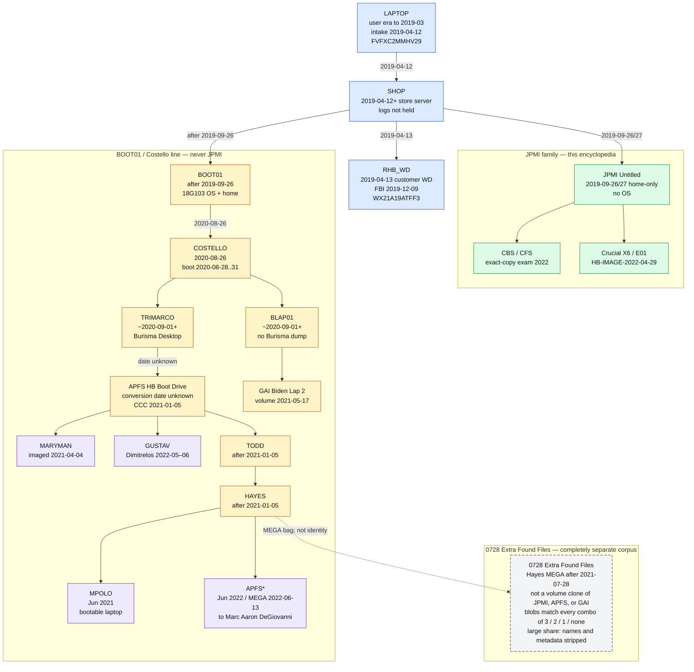
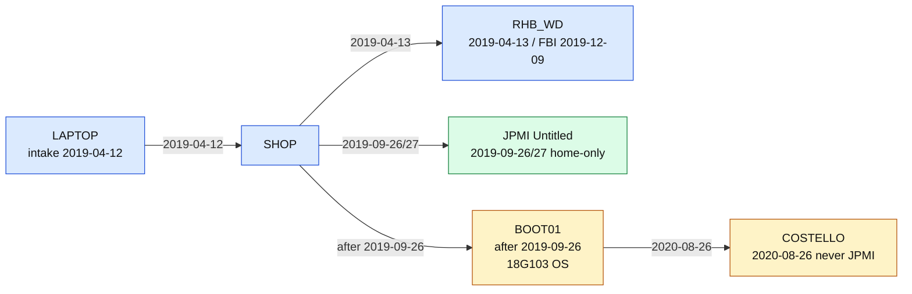

# Where the copies split (JPMI, Costello, Todd, APFS, GAI)

> **Hatnote.** This article is about **sibling copies**, not one stick renamed at each handoff. JPMI remains the Della Rocca → Sanders **HFS+ `Untitled` home copy**. Costello’s public handling and the later Hayes **APFS** / GAI **HFS+** images are a **bootable** branch. Main objects: [Copy lineages](COPY_LINEAGES.md). Method of *this* disk: [COPY_METHOD](COPY_METHOD.md). Timeline: [06](06_timeline_and_handling.md) · [index](TIMELINE.md).

Mac Isaac made **more than one** preservation copy. The examined JPMI volume is **not** the object Costello received. **BOOT01** (18G103, **after 26 Sep 2019**) is the Costello/APFS/GAI ancestor. Collapsing “the laptop” into a single chain (JPMI → Costello → Todd → APFS) misstates both the public record and the inventories.

## Lead finding

**Observed.** JPMI `Untitled` (source 122) has **no** `/System` tree, **no** ColorSync Display ICC named `iMac-…` / `DELL…`, and **no** ByHost plists for hardware UUIDs `42800DC4-C99A-5080-B2E2-A77873A211D1` or `E139561C-C7F1-523C-9FBD-C7DACE46BAE8`.

**Observed.** The Hayes **APFS** inventory (`rhb_drive`, source 1) and the GAI **HFS+** inventory (`gai_drive`, source 116) **both** contain those three ColorSync files with **identical mtimes** (28–31 Aug 2020) and dozens of matching ByHost rows. Both also contain macOS **10.14.6** `SystemVersion.plist` (mtime 21 Sep 2019) and CCC Preboot scaffolding.

**Interpretation.** A **bootable** Hunter `roberthunter` macOS volume (**BOOT01**, built **after 26 Sep 2019**) was **run on real hardware** in the same week Costello received a Mac Isaac FedEx drive. That session’s host/monitor fingerprints were later **copied into** APFS (Dec 2020 construction) and GAI (May 2021 volume). They were **never written on the examined JPMI `Untitled` disk**. **Costello never received JPMI.**

**Limitation.** ColorSync/ByHost name **displays and host UUIDs**, not Costello. They do not prove Manhasset versus another handler that week. APFS/GAI timestamps live in the project PostgreSQL `files` table; this GitHub tree does not republish those APFS/GAI bytes.

## Evidence classes for the news and chat record

| Class | Source | What it can establish |
|---|---|---|
| **Court-recited** | Delaware opinions | Mac Isaac emailed Costello **26 Aug 2020** and provided a copy of recovered data plus the repair authorization |
| **Complaint allegation** | *Biden v. Giuliani*, C.D. Cal. 2:23-cv-8032 (Sep 2023; later dropped) | FedEx of an “external drive” to Costello’s NY residence; defendants “booted up” the drive and created “bootable copies.” **Pleading, not a Costello affidavit** |
| **Contemporaneous journalism** | *New York* magazine, 12 Sep 2022 | Costello in Manhasset showed a small external drive and **booted to an Apple login** labeled **“Robert Hunter.”** He said the drive had been **cleaned up** before it reached him. Reporters later booted a Maxey-related drive with password given as `password`. Vish Burra said he created folders such as “Salacious Pics” / “The Big Guy” |
| **Participant account (this project)** | Todd Sanders / CybrJstr chat, 16 Jul 2026 | Trimarco-sourced copy: “bootable” / “everything dropped on the desktop”; “I had to monkey with it.. to get it to boot”; “I made my bootable right after I got it”; separately, a restricted Mac Isaac “original” imaged under attorney agreement (the JPMI metadata source) |
| **Comparative inventory** | `rhb_forensics` sources 1, 116, 122 | OS presence, ColorSync, ByHost, volume-construction dates (APFS/GAI are **out of this GitHub tree**; cited here as labeled comparison) |

## The split is at Mac Isaac, not at Costello renaming JPMI

<!-- diagram:named_graph -->

Export: [SVG](diagrams/named_graph.svg) · [JPG](diagrams/named_graph.jpg)
<!-- /diagram:named_graph -->

**Costello never received JPMI.** He received **BOOT01** (or a clone of it): a Mac Isaac copy that already contained the **18G103** system tree. The examined `Untitled` volume is the **Della Rocca → Sanders** stick — a **home-only** sibling dated **26 Sep 2019**, with no OS. Those are **two outbound copies** from the same shop.

## Deviation 1 — what JPMI is (and is not)

| Trait | JPMI `Untitled` (this repo) |
|---|---|
| Volume created | 26 Sep 2019 |
| Layout | `roberthunter` at HFS+ root; empty hard-link private dirs; EFI essentially unused |
| OS | **Not** a bootable macOS install |
| Aug 2020 ColorSync / ByHost | **Absent** |
| How Todd holds it | Della Rocca-coordinated mailing packet (Mac Isaac return address → Sanders) |

Someone who **boots their own Mac** and **mounts** this volume can **browse** `roberthunter` in Finder (permissions allowing). That does **not** produce an Apple login window titled **Robert Hunter**. That login requires a **user record on the boot volume** (`dslocal`) plus, in the NY Mag scene, a working OS on the attached disk.

## Deviation 2 — Costello (late August 2020)

**Public facts.** Court: copy to Costello ~**26 Aug 2020** (Marco Polo: **28 Aug**). NY Mag: Costello **booted** a small external drive to **Robert Hunter**. Complaint: “booted up” / “bootable copies.”

**Filesystem facts on the *other* inventories (not JPMI).** Between **28 Aug 05:32** and **31 Aug 18:06** (APFS `files.mtime`), a bootable volume wrote:

- PowerManagement and IOKit graphics state;
- ColorSync **`iMac-2838C3DD-A394-78C1-4A5E-57649BBC5643.icc`**;
- then host UUID **`E139561C-…`** and ColorSync **`DELL3007WFPHC-…`** (29 Aug) and **`DELL U2410-…`** (31 Aug);
- `quit_installer` logs dated 27 and 31 Aug under `Users/roberthunter/Library/Application Support/.dir/`.

**How this relates to JPMI.** Those writes are **macOS-running-against-the-volume** artifacts. They **cannot** be produced by attaching the examined home-only `Untitled` disk to Costello’s Mac and logging in as Costello. They **are** what one expects if Costello (or someone in that week) **booted a clone that already contained Hunter’s OS and account** — matching NY Mag — **or** if an OS was added to a Mac Isaac data copy *before* 28 Aug 2020.

**What Costello’s line then did that JPMI did not:** acquire **foreign host identity** (iMac, then Dell monitors); later **folder staging** and “cleanup” (Costello’s NY Mag remark; Burra folders on the Maxey-shown drive — **that drive is not JPMI**). JPMI’s Oct 2020 marker remains a **Desktop `.DS_Store`**, not ColorSync.

## Deviation 3 — Costello line → Trimarco → Todd (bootable rebuild)

**Public context.** [Raw Story, 13 Apr 2022](https://www.rawstory.com/michael-trimarco/): Mike Trimarco told Ann Vandersteel in **October 2020** he had been analyzing laptop contents, then moved into Byrne’s election operation. LA Times (17 Jun 2022): Giuliani asked Trimarco to look at documents on the laptop.

**Todd (16 Jul 2026 chat).** “Ours was from Mark Trimarco”; Desktop-dropped; **had to alter it to boot**; made his bootable **right after** receipt. He **also** holds the restricted Mac Isaac original under Della Rocca agreement — the source of **these JPMI reports**.

**APFS construction (`HB Boot Drive`).** **TRIMARCO → APFS** at an **unknown** date. Spotlight health check **12 Dec 2020 20:22:36 UTC**; CCC `BaseSystem.dmg` / Preboot `boot.efi` the same hour; named CCC snapshots **5 Jan 2021**. `SystemVersion.plist` still mtime **21 Sep 2019** (inherited Mojave tree). August 2020 ColorSync **mtimes preserved** across the clone. After **5 Jan 2021**, **APFS** fans to **MARYMAN**, **GUSTAV**, and **TODD → HAYES**.

**Interpretation.** Todd’s “it was not bootable until I made it so” describes the **Trimarco object he received** (folder dump / broken clone), not the entire Mac Isaac universe. A bootable Hunter OS **already existed in August 2020**. The named **APFS** node is the TRIMARCO conversion, not a clone of JPMI `Untitled`.

**Limitation.** Chat + CCC dates do **not** hash-identify Todd’s stick as serial `0241M2042085`. “Todd may have created *a* bootable derivative” ≠ “Todd created the SanDisk in this corpus.”

## Deviation 4 — GAI is not “before the OS”

GAI `Biden Lap 2` is truncated HFS+ with a **full System tree** (≈259,850 `System/` paths), `boot.efi`, `dslocal`, same 10.14.6 plist, **same three August 2020 ICCs**. HFS+ volume/check activity **17 May 2021**; later Mail/iMessage handling through June 2021; project image acquired **spring 2023** at GAI Tallahassee.

GAI is a **later HFS+ rebuild** of the **bootable** branch, not an ancestor of JPMI `Untitled` and not proof that Costello only had a data folder.

October 2020 `Color LCD-…` profiles **diverge** between GAI and APFS (different files/times). After August, the bootable siblings were **no longer identical**.

## Could Costello use JPMI as Hunter on his own Mac?

| Action | Result |
|---|---|
| Boot Costello’s Mac, mount `Untitled` | Finder access to `roberthunter`. Login window is **Costello’s users** |
| Option-boot / Startup Disk from a **full OS** clone | Apple login **Robert Hunter** — NY Mag scene; **not** JPMI as examined |
| Create a local account and point home at `/Volumes/Untitled/roberthunter` | Possible for a technician; not the described login; would **not** write system ColorSync ICCs onto JPMI (and JPMI has none) |

## Named reconstruction (tightest graph)

Node names used below: **LAPTOP**, **SHOP**, **RHB_WD**, **BOOT01**, **JPMI**, **COSTELLO**, **TRIMARCO**, **BLAP01**, **APFS**, **GAI**, **MARYMAN**, **GUSTAV**, **TODD**, **HAYES**, **MPOLO**, **APFS***.

| Node | Dates on the node |
|---|---|
| **LAPTOP** | User-era activity through **March 2019**; presented at the shop **12 Apr 2019** (serial `FVFXC2MMHV29`) |
| **SHOP** | Recovery begins **12 Apr 2019**; store-server staging (logs not held) |
| **RHB_WD** | Customer Western Digital delivered **13 Apr 2019** (`WX21A19ATFF3`); surrendered to FBI **9 Dec 2019** |

### September 2019: JPMI first; BOOT01 only after 18G103 shipped

**Two shop products.** They are not two births of the same disk. **Costello never received JPMI.**

| Node | When the *copy* exists | What the inventories actually timestamp |
|---|---|---|
| **JPMI** | Volume **26 Sep 2019 22:59:02 CDT**; **8** inventory rows **27 Sep ~01:56–01:59** (Mail `.DS_Store`, new `.journal`, Spotlight Store-V1) | Home-only `Untitled`. **No** `/System`. **No** 18G103 tree. |
| **BOOT01** | **After 26 Sep 2019** (earliest: public ship of the OS it contains) and **before 26 Aug 2020** (Costello receipt). Live on hardware by **28 Aug 2020**. | APFS and GAI share **~13,870** files with mtime **19 Sep 2019** (`System` + `Applications`, **zero** `Users`) and **~12,693** with mtime **21 Sep 2019** (`System`/`Library`, **zero** `Users`). Identical `SystemVersion.plist` SHA-256 `43724d51…7684c`, mtime **2019-09-21 00:28:14**, macOS **10.14.6 / 18G103**. Those 19–21 Sep stamps are **Apple payload dates**, preserved through install/clone. They are **not** BOOT01’s create date. |

Apple published [10.14.6 Supplemental Update 2 (build 18G103) on 26 Sep 2019](https://support.apple.com/en-us/103104). A volume whose `SystemVersion.plist` identifies **18G103** cannot have been *created as that OS* before that release. Installers routinely keep package mtimes (19–21 Sep). CCC Recovery `boot.efi` / `immutablekernel` on APFS/GAI also sit at **21 Sep 01:21** for the same reason.

Hunter could not have applied 18G103 in April 2019 (the build did not exist). **SHOP** applied that Mojave tree to **BOOT01 after 26 Sep 2019**. JPMI `Untitled` is the **home-only** job the same evening the update became public; it never received `/System`.

<!-- diagram:shop_outbound -->

Export: [SVG](diagrams/shop_outbound.svg) · [JPG](diagrams/shop_outbound.jpg)
<!-- /diagram:shop_outbound -->

### 2020–2021: COSTELLO, then TRIMARCO vs BLAP01

COSTELLO (26 Aug 2020) is **BOOT01**, never JPMI. Live ColorSync writes **28–31 Aug 2020** (iMac, then DELL3007 and U2410) are identical on APFS and GAI.

- **TRIMARCO** (~1 Sep 2020+): APFS-only Burisma Desktop folders 31 Aug–2 Sep 2020. **TRIMARCO → APFS** conversion date unknown; CCC snapshots **5 Jan 2021**. Then **MARYMAN**, **GUSTAV**, **TODD → HAYES → MPOLO / APFS***.
- **BLAP01** (~1 Sep 2020+): no Hunter.Burisma / Desktop Documents trees; heavier 1–3 Sep 2020 mtime mass (319+497+639 vs APFS 36+75+53); unique Color LCD 2020-10-28; GAI volume `Biden Lap 2` **17 May 2021**.

**Last shared boot fingerprint:** 31 Aug 2020 Dell U2410 ICC (both inventories). **First clear APFS-only political staging:** 1–2 Sep 2020 Burisma Desktop folders (Washington Post later saw those names on a Maxey drive). **Color LCD profiles diverge 19–28 Oct 2020.** **TRIMARCO → APFS** conversion date is **unknown**; named CCC snapshots **5 Jan 2021** bound the APFS destination. Downstream examiner and author copies are **after that date**.

### After 5 Jan 2021: APFS fans out

| Node | Date | What it is |
|---|---|---|
| **MARYMAN** | Imaged **4 Apr 2021** | Maryman & Associates / Associated Newspapers; SanDisk Extreme serial `20142M400253` (not the project SanDisk `0241M2042085`). Structurally APFS-family. *Daily Mail* Apr 2021. |
| **GUSTAV** | **May–Jun 2022** (deletion analysis **1 Jun 2022**) | Konstantinos “Gus” Dimitrelos / Washington Examiner. APFS-structure copy, **not** JPMI. |
| **TODD** | After **5 Jan 2021** | Sanders holding/working an APFS-family bootable (distinct from his Della Rocca **JPMI** packet). |
| **HAYES** | After **5 Jan 2021** | Conan Hayes working copies sourced via Todd/APFS line. |
| **MPOLO** | **Jun 2021** | Marco Polo schematic (report p. 579): Costello/Giuliani line **Jun 2021 → Marco Polo**. This encyclopedia: they used Hayes’s **bootable laptop**, not JPMI. |
| **APFS*** | **Jun 2022** / MEGA **13 Jun 2022** | Hayes `RHB_Boot.imgc` (HDD Raw Copy Tool) sent to **Marc Aaron DeGiovanni**. The indexed `rhb_drive` image in the broader project. **Not** JPMI. |

The same named graph is at the top of this article ([SVG](diagrams/named_graph.svg) · [JPG](diagrams/named_graph.jpg)).

**Probable, not proved:** BOOT01 is the object FedEx’d as COSTELLO (needs serial/hash). TRIMARCO → APFS conversion date is unknown; CCC snapshot names **5 Jan 2021** are the earliest dated APFS checkpoints. TODD → HAYES is attribution (chat + later deliveries), not a hash bridge. BLAP01 is a project label for GAI’s HFS+ ancestor. **JPMI is not an ancestor of COSTELLO, TRIMARCO, APFS, HAYES, MPOLO, or APFS*.**

## What this encyclopedia still claims

The Della Rocca → Sanders **JPMI** reports remain a **home-folder preservation copy** with sparse post-2019 Finder/index handling. CBS/CFS described an “exact copy” of the **FBI-lineage** data as lacking post-April 2019 *user* files. That finding is about **that family**. It is **not** a finding that the Costello/Trimarco/Hayes **bootable** clones were unused after April 2019 — APFS and GAI show they were.

## See also

- [Diagrams](diagrams/README.md)
- [Copy lineages](COPY_LINEAGES.md)
- [How the files left the laptop](COPY_METHOD.md)
- [People](PEOPLE.md) (Costello, Sanders, Trimarco)
- [Source matrix](09_source_matrix.md)
- [Bibliography](BIBLIOGRAPHY.md)
- Parent-project notes: `RHB_extra/research/2026-07-16_todd_sanders/README.md`, `RHB_extra/forensics/reports/0728_CHAIN_OF_CUSTODY_JPMI_APFS_GAI_BURST_SYNTHESIS_2026-07-23.md`
