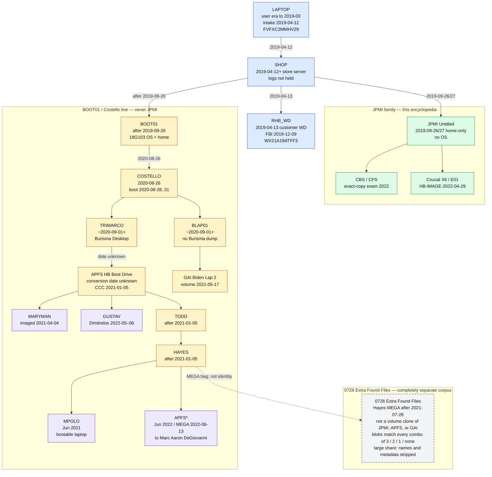

# Copy lineages

> **Hatnote.** This article distinguishes **physical devices and copies**. JPMI is one named lineage. It is not a synonym for every file that later appeared in political circulation. See [Scope](SCOPE.md).

Digital provenance fails when people collapse JPMI, APFS, GAI, 0728, and press extracts into the phrase “the laptop.” This page keeps them separate.

## Objects that are not the same thing

| Object                        | What it is                                                                      | Status in this encyclopedia                                                                                                                                                            |
| ----------------------------- | ------------------------------------------------------------------------------- | -------------------------------------------------------------------------------------------------------------------------------------------------------------------------------------- |
| **Retained repair laptop**    | The one of three machines left 12 Apr 2019                                      | Original hardware; FBI took it 9 Dec 2019; not returned to anyone, per this project’s open-questions list                                                                              |
| **Customer external HDD**     | Drive brought 13 Apr 2019 for recovered data                                    | Surrendered to FBI 9 Dec 2019 with the laptop                                                                                                                                          |
| **Store server staging**      | Mac Isaac's intermediate step                                                   | His account; **logs not held**                                                                                                                                                         |
| **Father / Albuquerque copy** | Preservation copy Mac Isaac describes for Sep–Oct 2019 FBI approach             | Period consistent with HFS+ creation 26 Sep 2019; **physical identity unproved**                                                                                                       |
| **Pre-surrender exact copy**  | Copy Mac Isaac made **before** FBI pickup, per Delaware Supreme Court           | Strongest public anchor that a Mac Isaac direct copy existed independently of FBI custody                                                                                              |
| **BOOT01**                    | Shop copy containing Mojave **18G103**, created **after 26 Sep 2019**           | Ancestor of COSTELLO / APFS / GAI. Payload mtimes 19–21 Sep are Apple package dates, not create date. [Branch splits](BRANCH_DEVIATIONS.md)                                            |
| **Costello copy (COSTELLO)**  | Aug 2020 transfer of **BOOT01** (or a clone) to Giuliani’s attorney             | **Never JPMI.** NY Mag: Costello **booted** to login **Robert Hunter**. Host/monitor writes **28–31 Aug 2020** on APFS/GAI only                                                        |
| **NY Post material**          | Published 14 Oct 2020 via Giuliani                                              | Public event; not a disk serial                                                                                                                                                        |
| **CBS / CFS “exact copy”**    | Della Rocca → CBS, examined 2022                                                | Independent forensic result on a Mac Isaac/FBI-lineage copy                                                                                                                            |
| **Sanders / JPMI media**      | Della Rocca → Sanders (mailing packet) → reports in this repo                   | Later custody medium is the **Crucial X6**; image `HB-IMAGE-2022-04-29.E01`                                                                                                            |
| **Apelbaum retained copy**    | Oct 2020 imaging of Mac Isaac’s still-held copy                                 | **JPMI lineage**, not hash-identical to the X6 E01. The copy Apelbaum tried to get to Fox / Tucker. **Not** 0728                                                                       |
| **Hayes APFS (**`APFS`**)**   | TRIMARCO converted to APFS at an **unknown** date; CCC snapshots **5 Jan 2021** | Not a clone of JPMI `Untitled`. [Branch splits](BRANCH_DEVIATIONS.md)                                                                                                                  |
| **MARYMAN**                   | Maryman imaged a related SanDisk **4 Apr 2021**                                 | APFS-family; serial `20142M400253`                                                                                                                                                     |
| **GUSTAV**                    | Dimitrelos / Washington Examiner **May–Jun 2022**                               | APFS-structure; not JPMI                                                                                                                                                               |
| **TODD** (APFS working copy)  | After **5 Jan 2021**                                                            | Distinct from Della Rocca→Sanders **JPMI** packet                                                                                                                                      |
| **HAYES**                     | After **5 Jan 2021**, from TODD                                                 | Working copies Conan Hayes then distributed                                                                                                                                            |
| **MPOLO**                     | **Jun 2021** (their schematic)                                                  | Hayes **bootable laptop** + later 0728. Did **not** analyze JPMI                                                                                                                       |
| **APFS***                     | **Jun 2022** / MEGA **13 Jun 2022**                                             | Hayes image to **Marc Aaron DeGiovanni**. Not JPMI                                                                                                                                     |
| **GAI HFS+**                  | Truncated `Biden Lap 2` image (`GAI://`); volume activity **17 May 2021**       | Full OS; same Aug 2020 ColorSync ICCs as APFS. Parallel bootable-branch rebuild. **Not** this GitHub tree                                                                              |
| **0728 Extra Found Files**    | Hayes MEGA bag after **28 July 2021**                                           | **Completely separate corpus** — not a clone of JPMI, APFS, or GAI. Blobs match **every combination** of those three (3, 2, 1, or none). Large share: original names and metadata stripped; provenance unknown. Out of scope for JPMI tables |
| **Marco Polo Report v4**      | Published compilation (4th printing 2024)                                       | Analyzed the Hayes **bootable APFS** machine + 0728. **Did not analyze JPMI**                                                                                                          |
| **This GitHub repository**    | Metadata/hash witness by **459Crimes / Marc Aaron DeGiovanni**                  | **No source-file bytes**. [Author](AUTHOR.md)                                                                                                                                          |

## Diagram

<!-- diagram:named_graph -->

Export: [SVG](diagrams/named_graph.svg) · [JPG](diagrams/named_graph.jpg)
<!-- /diagram:named_graph -->

## 0728 is a separate corpus

Treat **0728 Extra Found Files** as a **completely separate corpus**. The dashed edge from **HAYES** is a **MEGA distribution path** (after **28 July 2021**). It is not volume identity: 0728 is not a clone of JPMI `Untitled`, not a clone of APFS `HB Boot Drive`, and not a clone of GAI `Biden Lap 2`.

**Observed.** SHA-256 matching of 0728 blobs against those three inventories is **not** a single overlap class. The same bag contains media that matches **all three**, each **pair**, each **singleton**, and **none** of JPMI / APFS / GAI.

| 0728 blob vs JPMI, APFS, GAI | What that can mean |
|---|---|
| All three | Same bytes exist in JPMI, APFS, and GAI. Shared `roberthunter` ancestry at content level; 0728 is still not those disks |
| Each pair only | JPMI∩APFS, JPMI∩GAI, or APFS∩GAI, absent from the third. Content-level cousins, not a fourth volume |
| Exactly one | Present in JPMI only, APFS only, or GAI only |
| None of the three | Unknown to the three named laptop-derived inventories |

**Observed.** A large portion of 0728 files has **original names and filesystem metadata stripped**. Those rows do not carry a usable path/time provenance even when the bytes hash to a known object. When they also hash to none of the three, origin is unknown.

**Interpretation.** Mixing 0728 into a sentence about JPMI, APFS, or GAI as if it were “the laptop” is a category error. Marco Polo used this sidecar **plus** the Hayes bootable laptop (**MPOLO**). That still does not make 0728 a JPMI table.

**Limitation.** This encyclopedia does not republish 0728 inventories. The author’s FBI referral on 0728 as potentially hacked is **out of scope**. See [Scope](SCOPE.md) · [Integrity](INTEGRITY.md) · [Author](AUTHOR.md).

## What “direct copy” means here

**JPMI belongs to a Mac Isaac-made lineage that existed before the original laptop and customer drive left his possession** (court-recited exact copy on 9 Dec 2019). The destination HFS+ volume was created **26 Sep 2019** by **formatting** `Untitled` **and copying** `roberthunter` **as files**, then later **volume-cloned** onto the X6. That is not a serial-number chain from the 12 April laptop SSD to serial `2145E498755E`. Method: [COPY_METHOD](COPY_METHOD.md).

The Costello/Giuliani/Hayes **bootable** copies descend from **BOOT01** (18G103, after 26 Sep 2019), **not** from examined `Untitled`. **Costello never received JPMI.** Split points: [Where the copies split](BRANCH_DEVIATIONS.md).

## Byte-identity with CBS

**Established from the common source** (same attorney, same purpose: unadulterated Mac Isaac/FBI-lineage copy). **Not** established by a published side-by-side hash of the CBS media against `HB-IMAGE-2022-04-29.E01` MD5 `682619c1884e6fe006664ba31deed698` / SHA-1 `fe918f0cff3304ab52875b984c88fee78ec05197`.

## How many copies?

Unknown. Mac Isaac describes copies he made. The public record does not establish a complete inventory of every clone in the preservation-copy period. That is an explicit open question.

## See also

- [Diagrams](diagrams/README.md)
- [Chain of custody](03_chain_of_custody.md)
- [How the files left the laptop](COPY_METHOD.md)
- [Where the copies split](BRANCH_DEVIATIONS.md)
- [Crucial X6](CRUCIAL_X6.md)
- [Mailing packet](MAILING_PACKET.md)
- [Marco Polo v4](MARCO_POLO.md)
- [Integrity](INTEGRITY.md)

