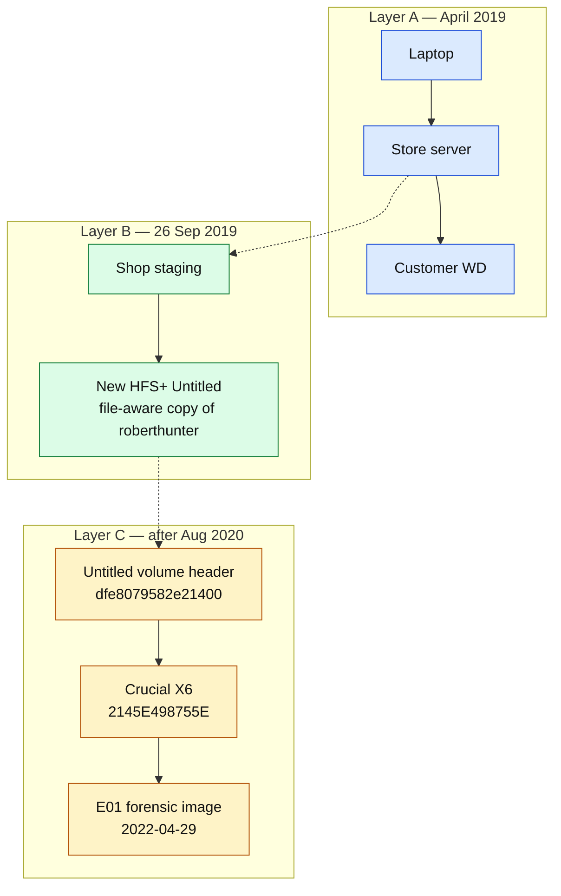

# How the files left the laptop

> **Hatnote.** Copy-method evaluation of the JPMI HFS+ volume. Not a named utility log. Companion objects: [HFS+ volume Untitled](HFS_VOLUME_UNTITLED.md) · [Crucial X6](CRUCIAL_X6.md) · [The Mac Shop](THE_MAC_SHOP.md) · [Copy lineages](COPY_LINEAGES.md). Hard-link measurements: [Glossary — alias / hard link](GLOSSARY.md#alias--hard-link). [Index](INDEX.md).

This article separates **three operations** that are easy to collapse into one story:

1. April 2019 recovery from the damaged Mac onto Mac Isaac’s store server and the customer drive;
2. 26 September 2019 creation of the HFS+ volume `Untitled` and a **file-aware copy** of the `roberthunter` home onto it;
3. a later **volume clone** of that HFS+ volume onto the Micron Crucial X6, then the 2022 **forensic image (E01)** of that stick.

The JPMI tables speak directly to (2) and (3). Operation (1) remains a **participant account** plus Quote #7469, not a reconstructed command line.

## Lead finding

The files on the examined disk are a **macOS user environment** (`roberthunter`) recovered at The Mac Shop in April 2019, then written as a **file-aware, timestamp-preserving copy** onto a **newly formatted journaled HFS+ volume named `Untitled` on 26 September 2019**. That volume was later **cloned as a whole volume onto hardware that did not exist in 2019** (Crucial X6, announced 25 August 2020). The acquisition `HB-IMAGE-2022-04-29.E01` is a **forensic image of that X6**, not a sector copy of the original laptop partition.

**Rejected:** a sector copy of the laptop’s native volume header (which would have kept the original volume name, UUID, create date, `/System`, and populated HFS+ hard-link directories).

**Not established:** the literal April 2019 program (`ditto`, Disk Utility, Dr.Fone, Target Disk Mode, `dd`, …). Server logs are not held.

## Observed structure of the destination

| Observation | Source |
|---|---|
| GPT disk + EFI + one journaled HFS+ data partition named `Untitled`, id `dfe8079582e21400` | `build/disk_info/`, `build/volume_info/01_volume_identity.tsv` |
| Volume creation **2019-09-26 22:59:02 CDT**; new `.journal` (~40 MB) and Spotlight Store-V1 | volume identity + `02_volume_metadata.tsv` |
| Volume-root catalog children include HFS+ special files (`$CatalogFile`, `$AttributesFile`, …), `^^^^HFS+ Private Data`, `.HFS+ Private Directory Data`, Spotlight, Trashes, and directory **`roberthunter`** — not a full OS (`/System`, volume-root `/Library`, `/Applications`) | `jpmi_cnid_map` parent_cnid = 2 |
| Private Data / Private Directory Data: **zero children** | `jpmi_cnid_map` |
| User-tree inventory **572,743** file rows (~215.5 GB); ~280 GB unallocated ranges; empty deleted catalog | census / volume identity |
| Created-time rows: 2017 **107,817**; 2018 **107,185**; Jan–Mar 2019 **353,662**; **September 2019: 15** | `build/metadata/01_time_distribution.tsv` |
| `Library/Mail/V6` modified **2019-09-27 01:56:35** in the same report family as `.journal` created **01:59:02** | `build/reports/04_post_2019_03_31_timeline.md` |
| `jpmi_alias_map`: 332,097 canonical + 323,233 alias; `max_paths_for_cnid` = 2; **all** two-path CNIDs are `file` + `file-*-slack` | PostgreSQL query 2026-08-17 |
| File-type `l` (symlink): **6,994** (`lrwxr-xr-x`), including framework `Versions/Current` and `Library/Containers/…` | `jpmi_file_report` |
| `$AttributesFile` **203,423,744** bytes; **10,832** `._` AppleDouble names as separate catalog files | `jpmi_cnid_map` |
| Custody device: Micron Crucial X6 serial `2145E498755E`, 500,107,862,016 bytes; E01 via ADI 4.7.1.2 | `build/disk_info/01_acquisition.tsv` |

Inventory URIs use `JPMI://Users/roberthunter/…`. The HFS+ catalog places that home at **volume root** as `roberthunter` (CNID 102). The `Users/` prefix is a report-layer path, not proof of a full `/Users` OS layout.

### The 283 GB “structures” line is not a cloned laptop

The census rollup **HFS+ data-partition structures / 3,435 rows / 283.0 GB** looks like leftover bulk from a sector copy. It is almost entirely **unused space on the 500 GB destination**:

| Piece | Rows | Bytes |
|---|---:|---:|
| TSK `[unallocated space]` ranges | 3,352 | 281,908,244,480 (281.9 GB) |
| Remaining HFS+ partition objects | 83 | ~1.08 GB (journal ~40 MB, Spotlight ~453 MB, `$CatalogFile` ~354 MB, `$AttributesFile` ~203 MB, …) |
| EFI | 6 | 209.7 MB |
| GPT / unpartitioned | 7 | 134.3 MB |
| `Users` (allocated home) | 572,743 | 215.5 GB |
| **Sum** | | **≈ 499 GB** vs X6 **500,107,862,016** bytes |

Formatting an external disk as Mac OS Extended (Journaled) **always** writes GPT, a small EFI partition, and an HFS+ journal. Copying ~216 GB of files onto that volume **always** leaves ~280 GB free. TSK represents free space as thousands of unallocated-range rows. None of that requires a sector copy of the laptop. A sector copy of the laptop volume would still have GPT/EFI/journal, but it would also keep the original volume header, `/System`, and populated hard-link private data — which this disk does not.

## Interpretation — three copy layers

<!-- diagram:copy_method -->

Export: [SVG](diagrams/copy_method.svg) · [JPG](diagrams/copy_method.jpg)
<!-- /diagram:copy_method -->

### Layer A — April 2019: laptop → shop server → customer WD

**Court-recited:** 12 April 2019 three damaged laptops; Quote #7469 ($85) includes recover data to the **store server**; 13 April customer returned with an external drive; recovery/transfer completed that day.

**Participant account:** Mac Isaac first staged recoverable data on a secure store server, then copied from that server onto the customer drive.

**JPMI does not reconstruct that command.** A damaged-drive job billed as “recover to store server” is typically **file-level recovery**, not a proved sector copy of the internal SSD. Nothing in the September 2019 volume header is the laptop’s original Macintosh HD (or equivalent). Later Mac Isaac copies **need not preserve laptop disk geometry** while still preserving a working home.

Dr.Fone / Wondershare trees **inside** `roberthunter` (Documents recoveries, Desktop `.app`) are **user-era tooling** (2017–2019 created/modified clusters). They are not identified as Mac Isaac’s April copy utility.

### Layer B — 26 September 2019: new HFS+ `Untitled`, file-aware copy

**Supported by JPMI metadata.**

A newly formatted HFS+ volume received the home tree with **birth and modification times from 2016–March 2019 intact**. Only ~15 objects were created in September 2019 (journal, Store-V1, related volume machinery). A naive copy that restamped creation would pile hundreds of thousands of created-times onto 13 April or 26 September. That did not happen.

The Mail/V6 `.DS_Store` cluster a few minutes before the new journal (same timestamp family) is a **copy session onto a just-formatted volume**, not a cloned catalog from years earlier. `Library/Mail` also carries a **2019-09-13** mtime — two weeks before this volume existed — which is a **preserved stamp from an earlier stage** (shop server or an earlier preservation copy). Timezone labels across report families still require normalization; the relative cluster is the evidence.

Catalog shape matches **home copied onto a blank Mac disk**, not an OS clone:

- default volume name `Untitled`;
- new volume UUID and create date;
- `roberthunter` at volume root;
- empty HFS+ hard-link private directories;
- ~280 GB unused space on a 500 GB-class disk.

The unnamed copier behaved like **`ditto` / macOS `copyfile` / `rsync -a` / Disk Utility restore of a folder / Carbon Copy Cloner in file mode**: preserve data-fork timestamps and **symbolic links** (6,994 type `l`), do **not** recreate HFS+ file hard links. Literal program name is not established.

### What this copy did not take from the laptop

A file-aware copy of a **home folder** onto a newly formatted disk does not transplant the source computer’s disk map or macOS system volume. On the examined JPMI volume:

| Laptop object | On this disk? |
|---|---|
| Original GPT (partition map of the internal SSD) | **No.** The GPT here belongs to the later custody disk (Disk GUID `c93db56d-…`), created when that disk was partitioned. |
| Original EFI boot payload (`EFI/APPLE`, `boot.efi`, …) | **No.** The ESP here is a small, essentially empty FAT32 partition (inventory: root empty; ~207 MB unallocated). That is a Disk Utility data-disk ESP, not a copied Mac boot partition. |
| macOS system volume (`/System`, `/private`, `/usr`, `/bin`, `/sbin`, volume-root `/Library`, `/Applications`) | **No.** Volume-root catalog children are HFS+ special files, journal, Spotlight/Trash/temp, and directory **`roberthunter` only**. |
| User home (`Mail`, `~/Library`, Photos, Documents, …) | **Yes.** That is almost the entire payload. |
| User-installed apps inside the home (e.g. Desktop `dr.fone toolkit for iOS.app`) | **Yes**, as files in the home tree. |

The GPT, EFI, and journal **on JPMI** are **destination** objects: they were created by formatting/partitioning the copy target (and later volume-cloned with `Untitled` onto the X6). They are not the laptop’s GPT/EFI sitting in a new box.

**Limitation.** This is a finding about **this lineage as examined**. It does not prove that Mac Isaac never imaged the internal SSD onto the shop server, or that the FBI-held laptop/WD lack a system volume. Those media are not in this repository. Later **APFS** / **MPOLO** / **APFS*** machines are **BOOT01 descendants** that carry an OS; they are not evidence that JPMI itself carried `/System`.

### Layer C — after August 2020: volume clone onto the Crucial X6, then E01

The Micron Crucial X6 portable SSD was **announced 25 August 2020**, with retail shipping around **1 September 2020**. Launch SKUs were 1 TB and 2 TB; a 500 GB-class X6 is still a **2020+ product**. It cannot be the physical disk formatted on 26 September 2019 unless the **2019 volume header was cloned onto later hardware**.

**Supported:** at least one **volume clone** of the September 2019 `Untitled` filesystem (preserving name, id `dfe8079582e21400`, create date, journal identity) onto serial `2145E498755E`. Disk Utility Restore, a block-copy utility, or equivalent can do that. It clones the **preservation volume**, not the laptop partition.

**Directly reported:** ADI 4.7.1.2 E01 of that X6, case `HB-2022-04-29`, image hashes in the acquisition table.

Delaware Supreme Court: Mac Isaac made an **exact copy** before the 9 December 2019 FBI surrender. That anchors a Mac Isaac clone independent of FBI custody. It does **not** identify the X6 serial as the 2019 format target.

## Hard links, slack, and “two files / one inode”

**Observed fact.** `jpmi_alias_map` was summarized as canonical/alias and “hard-link” metrics (`build/metadata/06_alias_summary.tsv`). Direct query of the same table shows:

| Test | Result |
|---|---|
| CNIDs with two **real** directory names | **0** |
| CNIDs with two paths | 323,233 — **all** `…` + `…-slack` |
| Children of `^^^^HFS+ Private Data` | **0** |
| Children of `.HFS+ Private Directory Data` | **0** |
| POSIX `nlink` column | **not ingested** |

**Interpretation.** The alias map is **TSK dual-path reporting** (allocated file + slack), not Unix `ln`. Slack is the same CNID; it is not a second user-visible file. Empty private-data directories mean **this volume has no live HFS+ file or directory hard links**.

That is consistent with a file-aware copy that **breaks** source hard links (each name becomes its own file and CNID). It is also consistent with a source home that had few hard links to begin with. A typical Mac **home** uses **symlinks** for sandbox containers and framework `Current`; those survived here as type `l`.

**Limitation.** Duplicate SHA-256 on two CNIDs is **not** a roster of broken hard links. 14,239 hashes appear on exactly two CNIDs; sampled same-basename pairs are Dr.Fone re-dumps of the same phone, identical iMovie templates, and similar. 243 Mail-related hashes appear on ≥2 CNIDs; some Mail versions hard-linked attachments, and Mail also stores real duplicates. Without source `nlink`, those rows stay unclassified.

### Known Mac “two names” that are not silent hard links in this data

| Object | Same inode? | JPMI record |
|---|---|---|
| TSK `*-slack` | Yes (same CNID) | 323,233 pairs; report artifact |
| Symlink (`Containers`, `Versions/Current`) | No | 6,994 type `l` |
| HFS+ file hard link | Yes | None on this volume |
| Resource fork / xattr | Same CNID, named fork | `$AttributesFile` ~203 MB; no `/rsrc` alias pairs |
| `._` AppleDouble | No — extra file | 10,832 separate CNIDs (often FAT/zip/network sidecars already on the Mac) |
| Finder alias / `.icloud` stub | No | Different CNID and bytes |
| APFS clone | Shared extents, not HFS+ `nlink` | N/A (destination is HFS+) |

## Terms used here

| Term | Use in this article |
|---|---|
| **File-aware copy** | Populate a formatted volume by writing files (new CNIDs). 26 Sep 2019 `Untitled`. |
| **Volume clone** | Copy that whole volume onto later hardware. X6 after Aug 2020. |
| **Forensic image (E01)** | Bit-stream of the X6 in 2022. |

JPMI is a **copied Mac home with destination filesystem machinery** (GPT, journal, Mail, Library) — not a folder of PDFs. That does **not** mean the laptop partition was sector-copied in April 2019. The 2022 E01 **is** a bit-stream of the **custody stick**, after the file-aware populate and the later volume clone.

The sequence:

> **April 2019:** recovery to shop server / customer drive (account + quote; tool unnamed). **26 September 2019:** new HFS+ `Untitled`; file-aware copy of `roberthunter` with timestamps and symlinks preserved, hard links not present on the destination. **After August 2020:** volume clone onto a Crucial X6. **29 April 2022:** E01 of that X6.

## What remains unproved

1. April copy utility, server image, first-generation hashes.
2. Whether `Untitled` is the drive Col. Mac Isaac took to Albuquerque.
3. The exact clone tool that put the 2019 header on serial `2145E498755E`.
4. Which duplicate SHA-256 pairs (if any) were hard links on the laptop.
5. Timezone normalization between volume-header CDT labels and TSK unlabelled times.
6. 2022 E01 vs 2024 last-write ([discrepancy](2022_2024_DISCREPANCY.md)).

## See also

- [What is JPMI?](01_what_is_jpmi.md)
- [Provenance — 5 Ws](02_provenance_5ws.md)
- [Limits](07_limits_and_open_questions.md)
- [Timestamps](TIMESTAMPS.md)
- [Integrity](INTEGRITY.md)
- [Where the copies split](BRANCH_DEVIATIONS.md)
