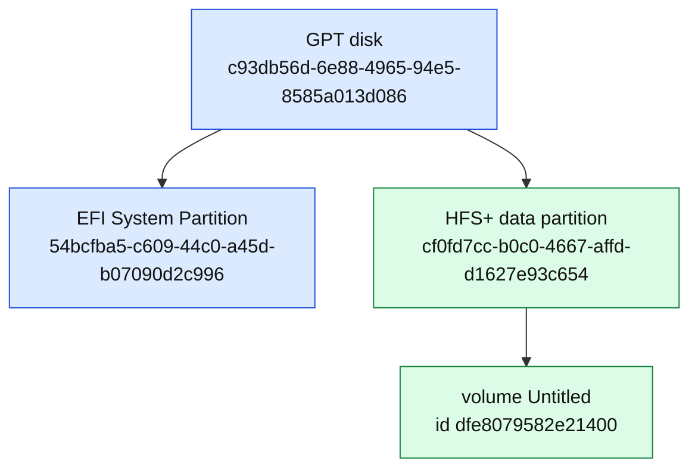

# Crucial X6 (custody medium)

> **Hatnote.** This is the **later USB SSD** described by the JPMI acquisition record. It is **not** identified as the original internal SSD of the April 2019 repair laptop. For the filesystem on it, see [HFS+ volume Untitled](HFS_VOLUME_UNTITLED.md). For the E01 wrapper, see [Forensic image](FORENSIC_IMAGE.md).

The acquisition record describes a **Micron Crucial X6 SSD USB Device**, serial **`2145E498755E`**.

## Reported identity

| Field | Value | Source |
|---|---|---|
| Model | Micron Crucial X6 SSD USB Device | `build/disk_info/01_acquisition.tsv` |
| Serial | `2145E498755E` | same |
| Size | 500,107,862,016 bytes | same |
| Sector size | 512 | same |
| Sector count | 976,773,168 | same |
| Disk GUID | `c93db56d-6e88-4965-94e5-8585a013d086` | same / partition map |
| EFI partition GUID | `54bcfba5-c609-44c0-a45d-b07090d2c996` | same |
| HFS+ partition GUID | `cf0fd7cc-b0c0-4667-affd-d1627e93c654` | same |
| HFS+ byte start | 209,732,608 | `02_partition_map.tsv` |
| HFS+ sector offset | 409,634 | acquisition / volume identity |

## Partition layout

<!-- diagram:x6_gpt -->

Export: [SVG](diagrams/x6_gpt.svg) · [JPG](diagrams/x6_gpt.jpg)
<!-- /diagram:x6_gpt -->

EFI presence means **Mac-oriented partitioned storage**, not “this stick was the boot disk of the 2019 Mac.”

## Why it is not the laptop SSD

1. Mac Isaac describes **server staging** then a **customer external drive**, then **later preservation copies**.
2. The HFS+ destination reports **creation 26 September 2019**, months after the April repair — a **new volume**, not a cloned laptop header. See [COPY_METHOD](COPY_METHOD.md).
3. A 500 GB-class USB SSD named `Untitled` is copy-destination geometry, not proof of original internal hardware.
4. The Crucial X6 portable SSD was **announced 25 August 2020** (shipping ~1 September 2020). It **cannot** be the disk formatted on 26 September 2019 unless the 2019 volume was **cloned onto later hardware**.
5. Historical diagnostics inside the user tree (`roberts-MacBook-Air`, serial `C02S953UH3QF`) are **migratable data**, not a chassis tag on this X6.

## How this device entered the examined lineage

Todd Sanders received a drive copy from **Brian Della Rocca**, who **coordinated the shipment** (per Sanders). The [mailing packet](MAILING_PACKET.md) photograph documents shipment from Mac Isaac's home address to Sanders. The acquisition note attributes the rank-2 manifest to Sanders (TSK 4.14.0). Whether the X6 in the E01 is the exact shipped stick, or a subsequent clone of it, is answered only insofar as the acquisition record describes **this** serial as the custody device that was imaged.

## See also

- [Copy lineages](COPY_LINEAGES.md)
- [Device report](../build/reports/01_computer_information.md)
