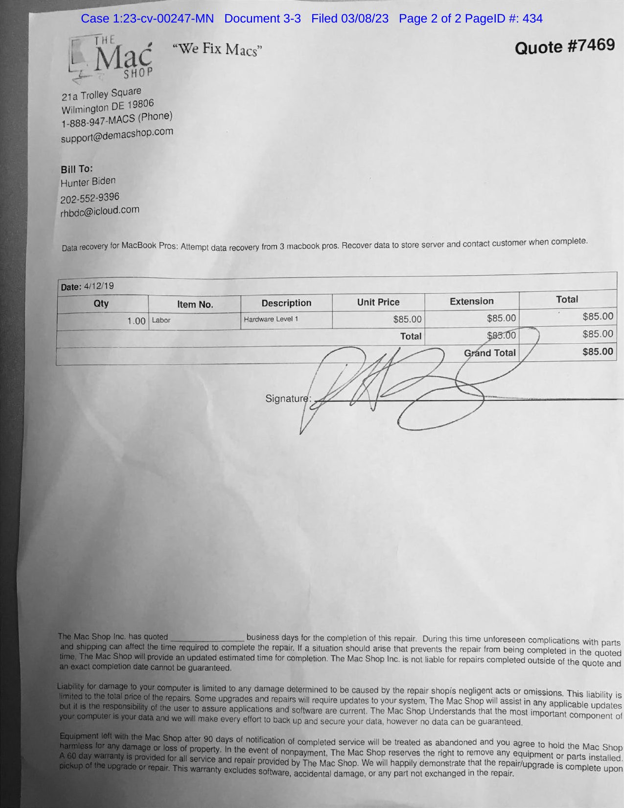
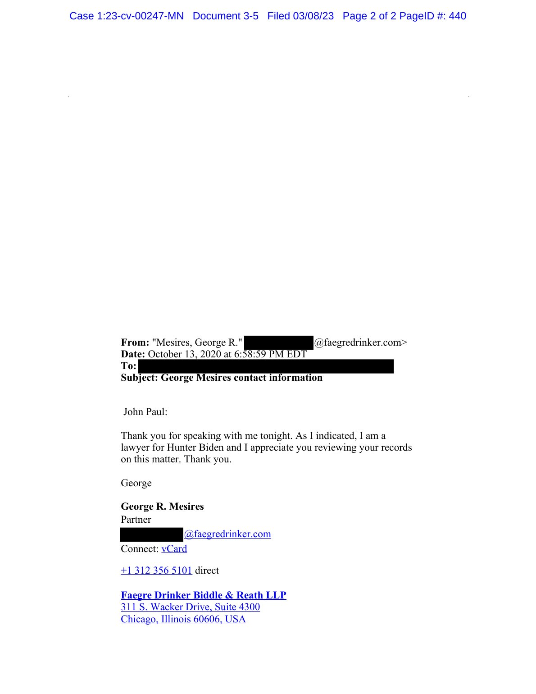
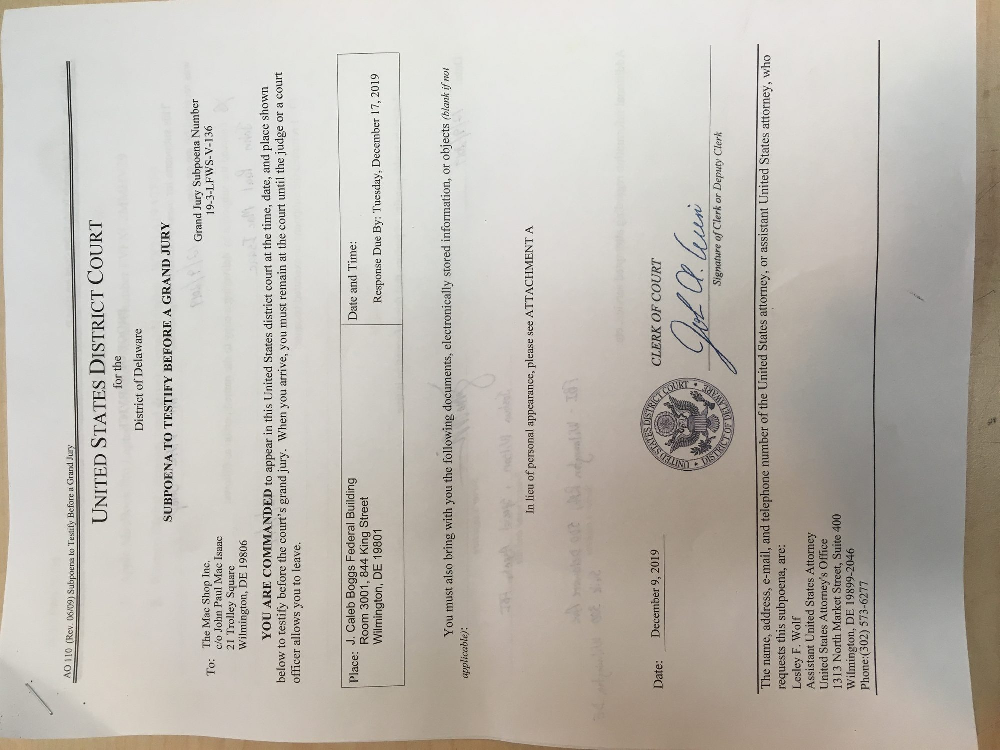
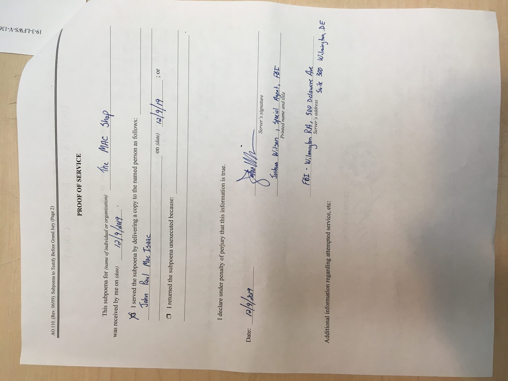
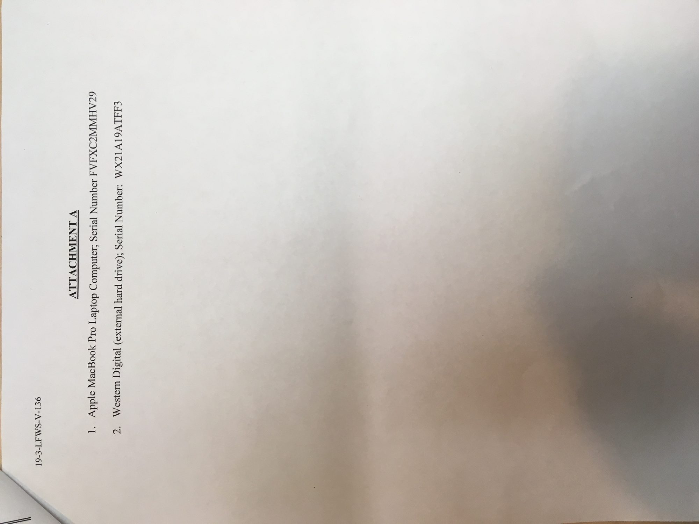

# Shop and FBI exhibits (photographs of the paperwork)

> **Hatnote.** Public-record scans from Mac Isaac’s Delaware filings and the later federal gun-trial exhibit list. These are **paperwork photographs**, not laptop contents. Congressional staff reports: [Congress](CONGRESS.md). Portraits of people and the storefront: [Portraits](PORTRAITS.md).

The documents below are the ordinary repair-shop and FBI paperwork that start the JPMI chain. They are **not** hashes of the Crucial X6 or of `HB-IMAGE-2022-04-29.E01`.

## 1. Signed repair authorization / $85 quote (12 April 2019)

**What it is.** The Mac Shop **Quote #7469**, filed as **Exhibit A** to Mac Isaac’s complaint (*Mac Isaac v. Politico et al.*, later D. Del. 1:23-cv-00247-MN, Document 3-3). Press coverage often calls the same page a “receipt” or “invoice.” It is the **in-shop work order**: billed to Hunter Biden, **$85**, dated **4/12/19**, with a handwritten signature on the signature line.

**What the form says (observed).**

| Field | As printed |
|---|---|
| Shop | The Mac Shop, **21a Trolley Square, Wilmington DE 19806** |
| Quote | **#7469** |
| Bill to | Hunter Biden |
| Phone / email on the form | `202-552-9396` / `rhbdc@icloud.com` |
| Scope | “Data recovery for MacBook Pros: Attempt data recovery from 3 macbook pros. **Recover data to store server and contact customer when complete.**” |
| Labor | Hardware Level 1, **$85.00** |
| Abandonment clause (footer) | Equipment left after **90 days of notification of completed service** treated as abandoned |

The “recover data to **store server**” line is the contemporaneous shop language that matches Mac Isaac’s later technical account. It is **not** a server log.

**Hosted files**

- Scan: [mac_shop_quote_7469_repair_authorization.jpg](exhibits/shop/mac_shop_quote_7469_repair_authorization.jpg)
- PACER PDF: [mac_shop_quote_7469_repair_authorization.pdf](exhibits/shop/mac_shop_quote_7469_repair_authorization.pdf) ([CourtListener](https://storage.courtlistener.com/recap/gov.uscourts.ded.81708/gov.uscourts.ded.81708.3.3_1.pdf))

Wayne A. Barnes (retired FBI), in a 3 July 2021 report commissioned by *Just the News*, concluded the signature on this receipt was written by RHB and was not a forgery. That is a **participant-commissioned handwriting opinion**, not a court finding. PDF: [Just the News](https://justthenews.com/sites/default/files/2021-07/Signature%20analysis%20of%20RHB%20-%20Wayne%20Barnes%202021-07-03.pdf).

Fox News published the same class of photograph on 19 October 2020 and stated it had **not** independently verified the signature ([Fox](https://www.foxnews.com/politics/hunter-biden-emails-documents-alleged-signature-fbi-paperwork)).

## 2. Email / invoice after the work was completed

Two different communications are often collapsed. They are separate objects.

### 2a. Shop contact after recovery (13–17 April 2019)

Delaware court opinions and Mac Isaac’s complaints recite:

1. Recovery/transfer finished **13 April 2019**.
2. Mac Isaac **called** the customer that day to say the work was done and to ask him to pick up the data.
3. On **17 April 2019** he sent an **electronic invoice for $85.00**.
4. The laptop and drive were not retrieved; the invoice was not paid.

This encyclopedia **does not presently host a photograph of the 13 April phone call** (there is none in the public PACER exhibits reviewed here).

The **emailed $85 invoice** is a **separate object** from Quote #7469’s signed paper. In *United States v. Robert Hunter Biden*, No. 1:23-cr-00061-MN (D. Del.), the government exhibit list records:

> **GTX 40** — “The Mac Shop Invoice Emailed to **rhbdc@icloud.com**” — admitted **4 June 2024** — witness **Erika Jensen** (FBI).

Trial reporting: Jensen testified investigators obtained that invoice email from **Apple iCloud** data (subpoenaed independently of the shop), matching the April 2019 repair ([Denver Gazette](https://www.denvergazette.com/2024/06/04/hunter-bidens-silver-laptop-shown-to-courtroom-during-gun-trial/)). The **image of GTX 40 itself is not on the public RECAP docket** — only the [admitted-exhibit list](exhibits/court/US_v_Biden_23cr61_exhibit_list.pdf).

Bill-to email on Quote #7469 and GTX 40’s addressee are the same address: `rhbdc@icloud.com`.

### 2b. George Mesires email (13 October 2020) — *not* the completion invoice

The first **shop-related email scan** in Mac Isaac’s complaint exhibits is **Exhibit C**: George R. Mesires (then counsel for Hunter Biden) writing Mac Isaac the evening of **13 October 2020**—the night **before** the *New York Post* story—not April 2019.

- [mesires_2020-10-13_email.pdf](exhibits/shop/mesires_2020-10-13_email.pdf) ([CourtListener Doc. 3-5](https://storage.courtlistener.com/recap/gov.uscourts.ded.81708/gov.uscourts.ded.81708.3.5.pdf))

Observed text: Mesires thanks Mac Isaac for speaking that night, identifies himself as a lawyer for Hunter Biden, and asks him to review his records. This is **post-story outreach**, not “work is complete.”

## 3. FBI grand-jury subpoena photographs (9 December 2019)

Filed as **Exhibit B** in the same complaint (Doc. 3-4): phone photographs of the physical papers served at the shop. Full PDF: [grand_jury_subpoena_photos_exhibit_B.pdf](exhibits/fbi/grand_jury_subpoena_photos_exhibit_B.pdf).

| Photo | What it shows |
|---|---|
| [AO 110 face](exhibits/fbi/grand_jury_subpoena_AO110_2019-12-09.jpg) | Grand Jury Subpoena **19-3-LFWS-V-136**, to The Mac Shop Inc. c/o John Paul Mac Isaac, **21 Trolley Square**; date **9 December 2019**; AUSA **Lesley F. Wolf**; response due 17 Dec 2019; “see ATTACHMENT A” |
| [Proof of service](exhibits/fbi/grand_jury_subpoena_proof_of_service_joshua_wilson.jpg) | Served **12/9/2019** on John Paul Mac Isaac; server **Joshua Wilson, Special Agent, FBI**, Wilmington RA, 500 Delaware Ave |
| [Attachment A](exhibits/fbi/grand_jury_subpoena_attachment_a_serials.jpg) | (1) Apple MacBook Pro **FVFXC2MMHV29**; (2) Western Digital external drive **WX21A19ATFF3** |

Those two serials are the **FBI seizure identifiers** for the shop devices. They are **not** the Crucial X6 serial `2145E498755E` in the JPMI acquisition record.

## What these exhibits do not prove

- They do not identify the **make/model of every one of the three** machines presented on 12 April 2019—only the MacBook Pro serial later listed on Attachment A.
- They do not prove the **copy utility** used on the store server.
- Quote #7469 plus GTX 40 together support **customer identity and billing**, not byte-identity between JPMI and the FBI-held media.
- Mesires’s 2020 email supports that Hunter Biden’s lawyer contacted the shop **before** the *Post* story, not that the April 2019 invoice was paid.

## See also

- [The Mac Shop](THE_MAC_SHOP.md)
- [Congressional reports](CONGRESS.md)
- [People](PEOPLE.md) (Wilson, Wolf, Mesires)
- [Mailing packet](MAILING_PACKET.md)
