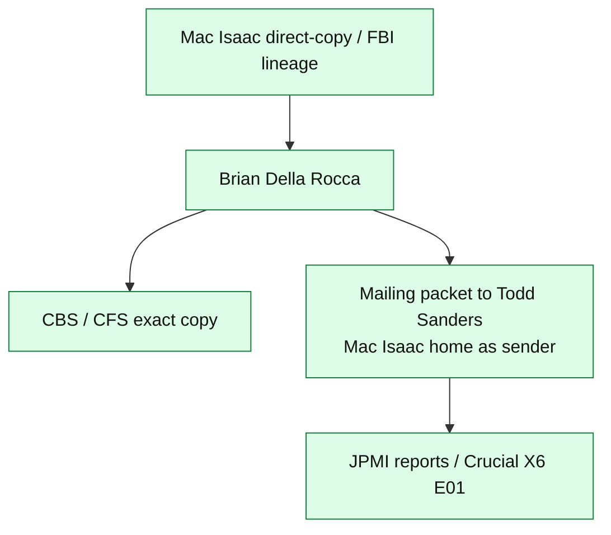

# Mailing packet (Della Rocca / Mac Isaac → Todd Sanders)

> **Hatnote.** Physical-custody exhibit for how JPMI reporting entered this project. Photograph: [`photo_20260716_120324.jpg`](../photo_20260716_120324.jpg). Not a hash of the E01.

## What the exhibit is

A photograph of the **mailing packet** in which a drive copy was shipped to **Todd Sanders**. The mailing label reflects **Mac Isaac’s home address as sender** and **Sanders as recipient**. Sanders states that **Brian Della Rocca**, Mac Isaac's attorney, **coordinated the shipment**.

That is a **handoff record** in the Mac Isaac–centered network:

<!-- diagram:jpmi_family -->

Export: [SVG](diagrams/jpmi_family.svg) · [JPG](diagrams/jpmi_family.jpg)
<!-- /diagram:jpmi_family -->

## What it supports

- The internal acquisition note naming Sanders is not a floating label; there is a **physical shipment** aligned with that name.
- JPMI sits in the **same attorney-centered provenance network** as the CBS-examined copy.

## What it does not support by itself

- Byte-identity with the CBS media (established by common source, pending side-by-side hashes).
- Identification of the **Albuquerque** drive.
- Identification of the **original laptop SSD**.
- A complete chain of every clone Mac Isaac made.

## Caption

The photograph is an exhibit of sender, recipient, and that it contained the drive copy as recorded by this project. Affiliation of Sanders with the America Project is in [People](PEOPLE.md) and [Source matrix](09_source_matrix.md), sourced to American Oversight and court/CBS records.

## See also

- [Copy lineages](COPY_LINEAGES.md)
- [Chain of custody](03_chain_of_custody.md) Stage 8
