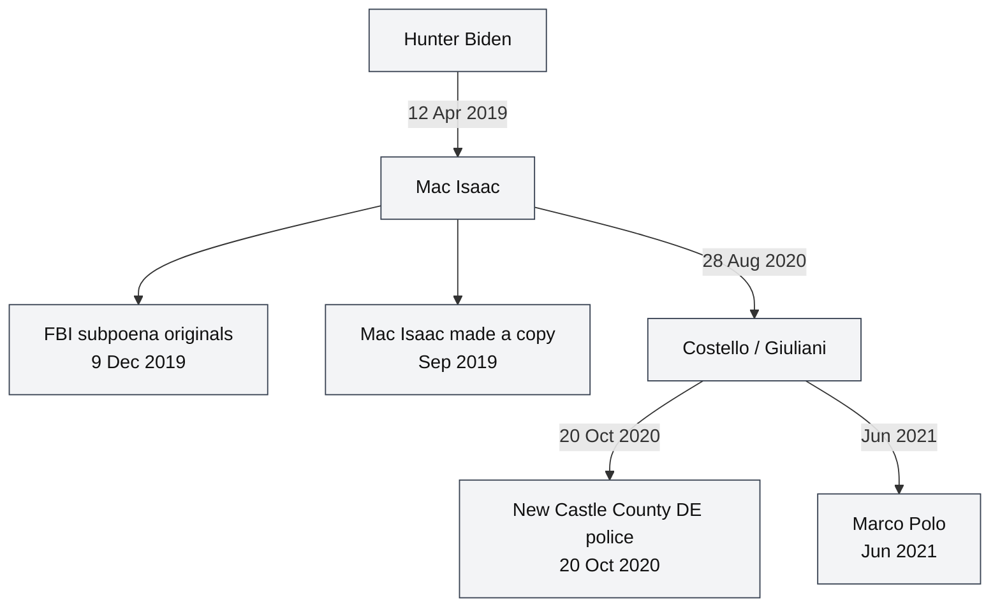

# Marco Polo *Report on the Biden Laptop* (4th printing)

> **Hatnote.** Secondary compilation, **not** a JPMI measurement and **not** a court finding. Fourth printing (2024), ICU, LLC dba Marco Polo, ISBN 978-1-7371866-3-2. Mac Isaac had **no** involvement; the authors state they disagreed with his disclosure methods. This page extracts only **shop / FBI / copy-lineage** details that belong in the JPMI encyclopedia. The report's crime catalog is out of scope.

## What corpus Marco Polo actually used

**Marco Polo did not analyze the JPMI copy** in this repository (HFS+ `Untitled` / Crucial X6 / `HB-IMAGE-2022-04-29.E01`).

459Crimes investigative work attributes Marco Polo's access to:

1. a **bootable laptop produced by Conan Hayes** (**MPOLO**, claimed receipt **Jun 2021**). That machine is downstream of **HAYES ← TODD ← APFS ← TRIMARCO ← COSTELLO ← BOOT01**, not of examined JPMI `Untitled`; and
2. the **0728 Extra Found Files** MEGA share (Hayes, after 28 July 2021) — a **large sidecar collection**. It did **not** come from the laptop files per se. Many items are of **unknown origin**; the set is **related to** laptop material, but **some files are completely unknown to the laptop**.

The later **APFS*** image (Hayes `RHB_Boot.imgc`, **Jun 2022** / MEGA **13 Jun 2022**) went to **Marc Aaron DeGiovanni**. It is a second HAYES outbound, not Marco Polo’s Jun 2021 laptop and not JPMI. APFS-family hashes are not combined with the JPMI E01. Marco Polo's email database, page counts, and contractors are not JPMI measurements. Shop/FBI **paperwork** they reprint can still be compared to court exhibits. See [Scope](SCOPE.md) and [Integrity](INTEGRITY.md).

**459Crimes / Marc Aaron DeGiovanni**, the author of *this* JPMI encyclopedia, was a Marco Polo member working with Ziegler from **May 2021**, pressed the shift from election-fraud work onto the laptop, and was the first to download **0728** from Hayes. That does **not** mean Marco Polo analyzed JPMI. See [Author](AUTHOR.md).

Source class: **published compilation** (often citing Mac Isaac's “The Truth” videos, S.D. Fla. Twitter exhibits, and two 2021–22 forensic contractors). Where they conflict, [court exhibits](EXHIBITS.md) and Delaware opinions take precedence.

## Marco Polo's account of its copy

Marco Polo states it set out in **September 2021** already possessing a copy, and its chain-of-custody schematic (report p. 579) is:

<!-- diagram:marco_polo_schematic -->

Export: [SVG](diagrams/marco_polo_schematic.svg) · [JPG](diagrams/marco_polo_schematic.jpg)
<!-- /diagram:marco_polo_schematic -->

That schematic is **Marco Polo's own drawing**. This encyclopedia maps their **Jun 2021** receipt to node **MPOLO**: a **bootable laptop** from **HAYES**, not JPMI `Untitled`. See [BRANCH_DEVIATIONS](BRANCH_DEVIATIONS.md).

## Shop and hardware details worth recording

| Statement in v4 | Status here |
|---|---|
| The Mac Shop, Inc. registered **2 March 2010**, Delaware file **4794855** | Delaware business filing ([The Mac Shop](THE_MAC_SHOP.md)) |
| Drop-off **12 Apr 2019 ~6:50 p.m. EDT**, three machines; salvage / keyboard / data-recovery split; MacBook Pro serial **FVFXC2MMHV29** | Serial matches [Attachment A](exhibits/fbi/grand_jury_subpoena_attachment_a_serials.jpg). Evening time is participant-class |
| WD serial printed as **WX21A129ATFF3** | **Conflicts** with the court photograph **WX21A19ATFF3**. The PACER photo is the seizure identifier used here; the extra `2` is recorded as a likely typesetting error |
| Internal inventory invoice **#6077** vs signed **Quote #7469** | Two numbers can coexist: 7469 is the signed work order hosted here; 6077 may be the CRM/invoice object (possible link to GTX 40). Not hash-proved |
| Drive drop and recovery completed **17 April** (citing Nolte/Breitbart) | **Conflicts** with Delaware opinions: return and completion **13 April**, electronic invoice **17 April**. This encyclopedia uses the court dates and records the scatter |
| Corporate **Dissolution-Short Form 31 Dec 2020** | Compatible with in-person close in **November 2020** |
| Last MacBook **use by RHB 17 March 2019** (Gus Dimitrelos / Washington Examiner) | Consistent with a pre-dropoff cutoff; not a JPMI volume-creation date |
| Maryman & Associates: original **Macintosh HD** created **28 March 2018**; 2017 MacBook Pro; iCloud account added **21 Oct 2018** | Describes the **repair-shop Mac's OS volume**, not JPMI's HFS+ `Untitled` created **26 Sep 2019** |
| iPhone XS serial **G0NXF19JKPFY** backed up on the laptop | Mobile-backup identity inside the user tree, not the shop Attachment A laptop serial |
| Mesires told Mac Isaac the drop-off was **2017**; paperwork is **April 2019** | Fits the hosted 13 Oct 2020 email as *Post*-eve outreach, plus a date error attributed to the client |

## FBI interaction (participant compilation)

v4 names **Wilmington RA / Baltimore Field Office** child-exploitation agents **Josh Wilson** and **Mike Dzielak** as the pair who:

- visited Mac Isaac's **home 21 Nov 2019** (Wilson asked about child pornography first);
- texted for a **timeline**;
- asked for the WD serial **~9:52 a.m. 9 Dec 2019**;
- served the subpoena **~11:00 a.m.** at the shop (AUSA **Lesley Wolf**);
- called back the same day for help **accessing the drive**.

**Joshua Wilson** is independently documented by the proof-of-service photograph and Fox's **Receipt for Property** (`272D-BA-3065729`). The second agent's surname is an unresolved conflict: Mac Isaac's book / NY Post quote **DeMeo**; Marco Polo identifies **Dzielak**. Both strings are recorded in [People](PEOPLE.md).

v4 dates the Albuquerque walk-in as **9 Oct 2019** (“lawyer up”), matching Mac Isaac's later video and sitting inside the existing date scatter.

Phone numbers, dates of birth, and home addresses reprinted in Marco Polo are omitted here.

## Independent-forensic statements it reprints

- **Gus Dimitrelos** (ex–Secret Service): examiner analysis reported as finding the drive authentic and **no evidence of hacking or file manipulation** (*Washington Examiner*, May 2022).
- **Maryman & Associates** (Brad Maryman / Joseph Greenfield): timestamps authentic; data not manufactured (*Daily Mail*, Apr 2021).

**Correction to the record:** those contractors used **GUSTAV** / **MARYMAN** copies whose **structure correlates to APFS**, **not** the JPMI HFS+ `Untitled` / Crucial X6 reports in this repository. They are not JPMI-table results. The author of this encyclopedia **holds copies similar to the ones they worked from** (including **APFS***). Their work is a **partial** attempt at the same material. See [Author](AUTHOR.md) and [Copy lineages](COPY_LINEAGES.md).

Dimitrelos and Maryman are therefore not examinations of the Della Rocca → Sanders JPMI media. They are also distinct from **CBS / CFS**, which examined a Della Rocca “exact copy” in the Mac Isaac/FBI-lineage network.

## See also

- [Author](AUTHOR.md)
- [Exhibits](EXHIBITS.md)
- [People](PEOPLE.md)
- [Timeline](06_timeline_and_handling.md)
- [Copy lineages](COPY_LINEAGES.md)
- [Scope](SCOPE.md)
- [Integrity](INTEGRITY.md)
